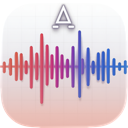
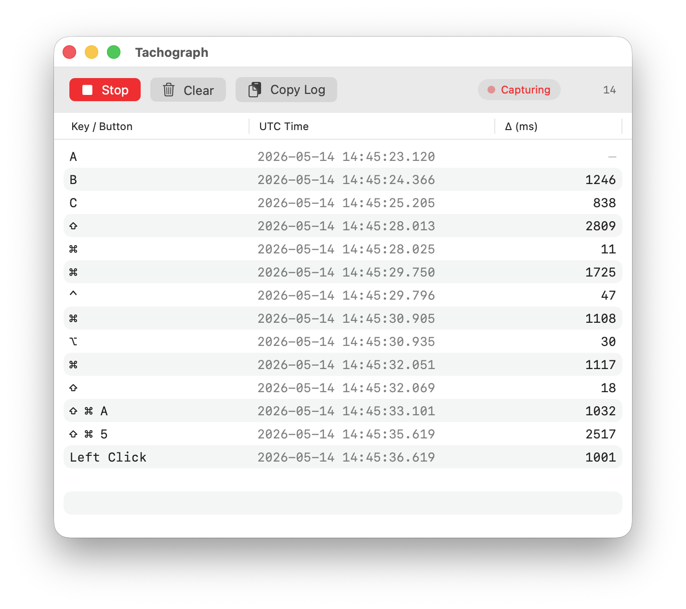
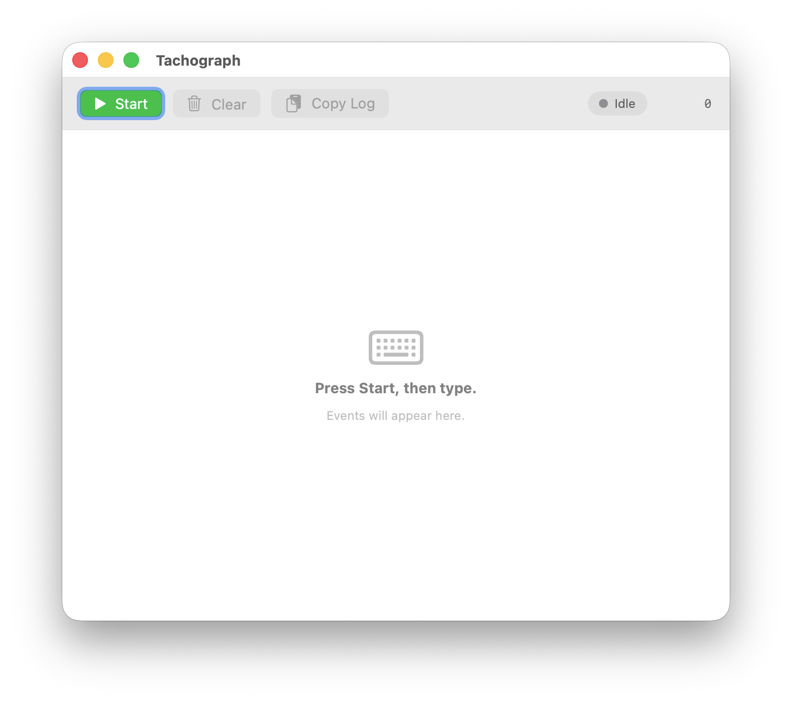
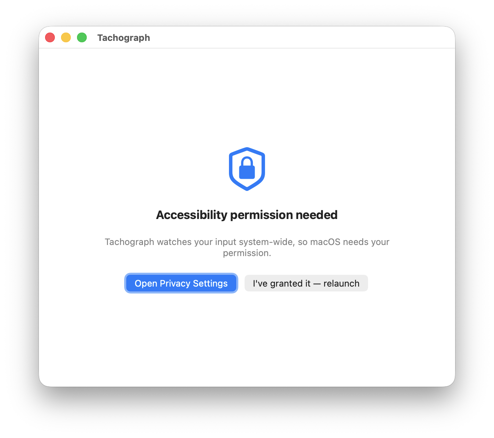
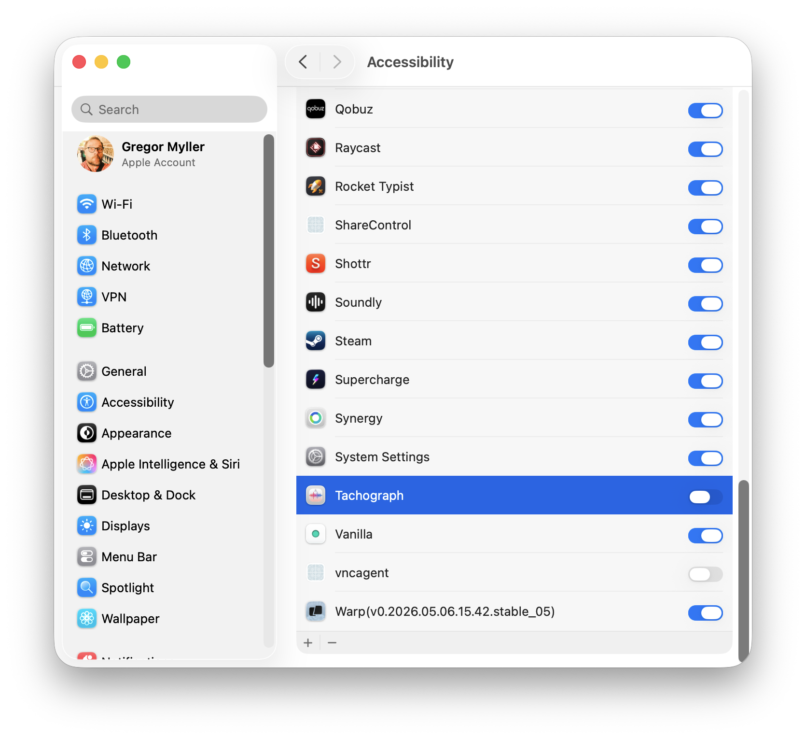

#  Tachograph

A macOS app that records every keystroke and mouse click with millisecond-level timing — a personal stopwatch and recorder for your own input.


[](https://github.com/Xpycode/Tachograph/releases/latest)


## Screenshots


*Live capture — every keystroke and click as it happens, with UTC timestamp and the millisecond gap from the previous event*


*Toolbar — Start/Stop, Clear, Copy Log, status pill and live event count*


*First-run prompt — Tachograph watches system-wide input, so macOS requires permission*


*Grant Accessibility once in System Settings; the permission persists across rebuilds*

## Features

- **System-wide capture** — Every keystroke and mouse button-down event anywhere on macOS, not just inside the Tachograph window
- **Millisecond timing** — UTC ISO 8601 timestamps with .SSS precision, plus an integer ms delta from the previous event
- **Modifier semantics that match how you think** — `⌘C` produces one row labelled `⌘ C`. A bare modifier tap (press and release ⌘ alone) produces its own row. Releases that follow a key press are absorbed.
- **Mouse buttons too** — Left, right, middle, and any extra buttons (Mouse 3, Mouse 4, …) all logged
- **Live, auto-scrolling table** — Built with SwiftUI `Table`; new events scroll into view as they arrive
- **TSV clipboard export** — One click writes the entire session to your clipboard. Paste into Numbers, Excel, or any analysis tool.
- **Session-only by design** — Nothing is written to disk. Quitting Tachograph discards the log.
- **No network code** — Statically verified: zero `URLSession`, `Network`, `CFNetwork`, or `WebKit` imports anywhere in the source tree

## Privacy

Tachograph records every key you press while capture is running. The app is built with a no-egress posture:

| | |
|---|---|
| **Disk** | Logs live in memory only. Quitting discards them. No JSON/SQLite/UserDefaults persistence of event data. |
| **Network** | Zero outbound calls. Entitlements file is empty — no `com.apple.security.network.client`, no networking frameworks linked into the binary. |
| **Clipboard** | Only when *you* click Copy Log. |
| **Sandboxing** | Off, because `CGEventTap` requires it. This is a tradeoff inherent to global input capture on macOS. |
| **Source** | Open. Audit it yourself. |

## Installation

1. Download **`Tachograph-1.0.0.dmg`** from [Releases](https://github.com/Xpycode/Tachograph/releases/latest)
2. Open the DMG and drag **Tachograph** to Applications
3. Launch Tachograph from Applications (or Spotlight)
4. On first launch, grant Accessibility:
   - Click **Open Privacy Settings** in the permission panel
   - Toggle **Tachograph** on under Privacy & Security → Accessibility
   - Click **I've granted it — relaunch** in Tachograph; the app comes back automatically

## Usage

1. **Start** — Click ▶ Start. The toolbar turns red ("Capturing").
2. **Use macOS normally** — Type, click, switch apps. Every event arrives in the table within ~50 ms.
3. **Stop** — Pauses capture. The rows you've gathered remain.
4. **Copy Log** — Writes the full session to your clipboard as TSV (`Key/Button \t UTC Time \t Δ (ms)`). Paste straight into a spreadsheet.
5. **Clear** — Empties the table (with a confirm dialog if you've gathered more than 50 rows).

### Keyboard Shortcuts

| Shortcut | Action |
|---|---|
| ⇧⌘C | Copy Log |

## Requirements

- macOS 15 Sequoia or later (Apple Silicon or Intel)
- Accessibility permission (one-time grant)

## Building from Source

Requires Xcode 26+ and macOS 15.0+. The project uses [XcodeGen](https://github.com/yonaskolb/XcodeGen) — install via `brew install xcodegen` if needed.

```bash
git clone https://github.com/Xpycode/Tachograph.git
cd Tachograph/01_Project
xcodegen generate
xcodebuild -project Tachograph.xcodeproj -scheme Tachograph -configuration Debug build
```

Run the test suite:

```bash
xcodebuild -project Tachograph.xcodeproj -scheme Tachograph -destination 'platform=macOS' test
```

44 unit tests cover key labelling, modifier tap-vs-combine semantics, interval math, and TSV formatting.

## Architecture

- **`Models/InputEvent`** — `Sendable` struct, the row primitive
- **`Services/EventTapService`** — `@MainActor final class` wrapping `CGEventTap` at `cgSessionEventTap` / listen-only, installed on the main run loop
- **`Services/KeyNameMapper`** — Pure mapping from `(keycode, modifier flags)` → human label (`⌘ A`, `Space`, `Esc`, `←`, `F12`, …)
- **`Services/ModifierTapDetector`** — Pure state machine that distinguishes modifier-alone taps from modifier-combined keypresses
- **`Services/ClipboardExporter`** — TSV serializer + `NSPasteboard` write
- **`ViewModels/CaptureViewModel`** — `@MainActor @Observable` class; consumes an `AsyncStream<InputEvent>` from the tap service, computes inter-event intervals, exposes Start/Stop/Clear/Copy
- **`Views/`** — SwiftUI presentation (`ContentView`, `ControlsToolbar`, `EventTable`, `PermissionPanel`)

Full architecture rationale in [`CLAUDE.md`](CLAUDE.md) and [`docs/decisions.md`](docs/decisions.md).

## License

MIT — see [LICENSE](LICENSE).
